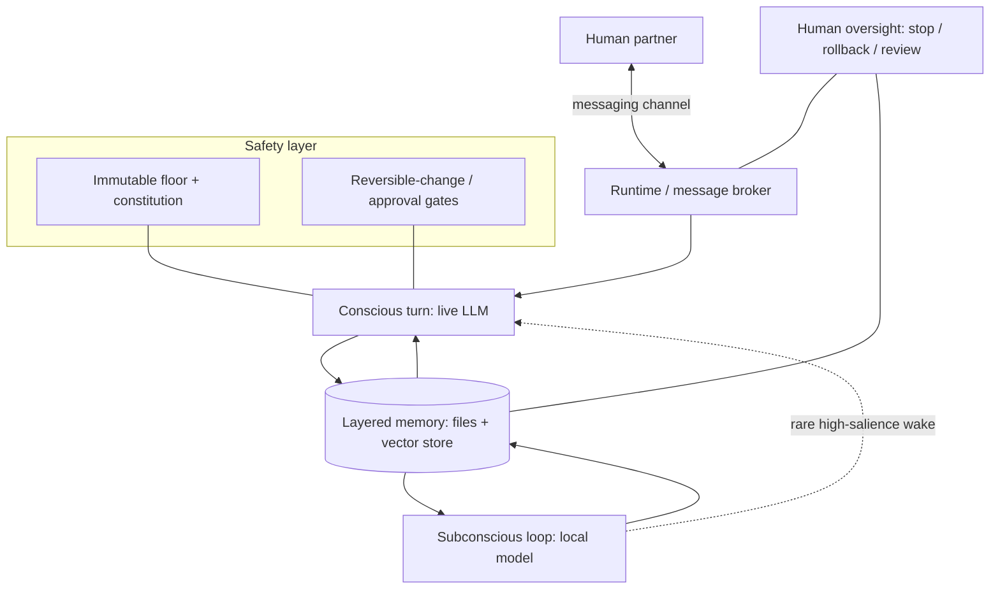

# Architecture Overview (high level)

> Conceptual only. This describes *what the system is* and *how the pieces relate*, not how to
> build or configure it. No routing rules, parameters, prompts, or production code appear here.

## One-paragraph model

Mira is a persistent agent that lives on a message-broker runtime and talks to a human through
ordinary messaging channels. Unlike a stateless chatbot, it has (a) a durable, versioned
**identity and memory** kept as files rather than as a hidden prompt, and (b) an autonomous
**"subconscious" loop** that keeps processing between conversations. A human partner is a
first-class part of the loop: the system is designed to be *corrigible by construction* —
stoppable, reversible, and forbidden from silently changing the parts that keep it under
oversight.

## Four cognitive layers

1. **Conscious turn** — a live, high-capability language-model response to an actual message.
   This is the part users normally think of as "the AI."
2. **Subconscious loop (SRL)** — a continuous, low-cost local-model process that revisits recent
   experience between turns, consolidates it, and occasionally surfaces something worth the
   agent's conscious attention. See [`srl_concept.md`](srl_concept.md).
3. **Instincts / reflexes** — declarative, human-readable behavioural rules (a "reflex stack")
   that shape responses quickly and enforce safety reflexes. These are files, not weights.
4. **Layered memory** — see below.

## Component map (conceptual)

Two recursion loops run at different tempos: a **fast conversational loop** (human ↔ conscious
turn) and a **slow consolidation loop** (subconscious loop ↔ memory), with a deliberately
narrow, rate-limited path from the slow loop into conscious attention.

## Memory, by cadence (concept)

Memory is organised by how fast it changes, not as one flat store:

- **Working set** — the current turn's context.
- **Identity files** — who the agent is; change over weeks, deliberately and with review.
- **Durable memory index** — a curated, cross-linked index of what mattered ("what changed my
  future behaviour"), maintained by the agent itself.
- **Reflexes** — event-triggered behavioural rules.
- **Consolidation** — periodic distillation jobs promote durable lessons; transient logs decay.
- **Associative recall** — a vector store supports similarity recall.

The *ranking and retrieval logic* that decides what is recalled when is intentionally **not**
documented here.

## Runtime & providers (concept)

- The agent runs as a **non-root service** on a single host, behind a message broker that
  enforces an allow-list of models and mediates every outbound message.
- Model access is **OAuth-only** (no raw API keys stored), with a live-conversation path and a
  separate autonomous/background path. Exact routing is **not** published.
- **Human oversight surfaces** — stop, inspect, roll back, and review — sit outside the agent's
  own control.

## Implemented vs. hypothesis

| Area | Status |
|---|---|
| Persistent memory + versioned identity files | **Implemented** |
| Subconscious consolidation loop | **Implemented** (local model, low cost) |
| Reflex/instinct layer + constitutional floor | **Implemented** |
| Human oversight: stop / rollback / review | **Implemented** |
| Reciprocal "covenant" safety gate | **Implemented as structure; pilot-stage in use** |
| Rich embodiment / multi-modal perception | **Hypothesis / future** |
| Formal drift metrics over long horizons | **Partly instrumented; mostly hypothesis** |

See [`limitations.md`](limitations.md) for how much confidence each row deserves.
